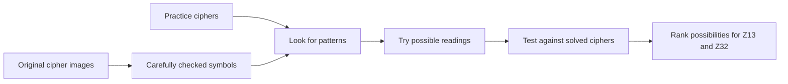

# Zodiac Cipher Analysis

## Can patterns reveal what a cipher is hiding?

This project studies four of the Zodiac ciphers: Z408, Z340, Z13, and Z32. The two longer messages have known solutions. The two shorter ones still attract many theories—but with so few symbols, coincidence can easily look like an answer.

The goal is not to announce a dramatic new solution. It is to build a careful, repeatable way to ask: **which possible readings deserve attention, and how uncertain are they?**

## The idea

1. Start with carefully checked copies of the original symbols.
2. Look for repetition, unusual patterns, and clues in how the symbols are arranged.
3. Test codebreaking methods on messages where the answer is already known.
4. Compare traditional techniques with machine learning only if it genuinely helps.
5. Apply the methods to Z13 and Z32 and show several ranked possibilities—not one unsupported claim.



## Why use the solved ciphers?

Z408 and Z340 act like answer keys. If a method cannot recover useful information from them without secretly seeing the answer, there is little reason to trust it on the unsolved ciphers. This keeps the project grounded in evidence instead of wishful pattern-matching.

## Progress

- Project setup is complete.
- The four cipher records and source images have been collected and checked.
- Structural exploration, the classical baseline, and reproducible synthetic dataset are complete.
- A small ML classifier earned its place as a synthetic cipher-family router; it is not a decoder.
- Final validation is complete. The classifier reproduced the expected broad family for both solved ciphers, but the classical decoder recovered only 3.2% of Z408. No solution is claimed for Z13 or Z32.

The guiding rule is simple: **interesting is not the same as proven.** This project ranks possibilities; it does not identify a suspect or claim that Z13 or Z32 has one certain solution.

## Explore the project

- [`docs/plan.md`](docs/plan.md) — the step-by-step research plan
- [`docs/architecture.md`](docs/architecture.md) — how the analysis will fit together
- [`docs/phases/phase-1/`](docs/phases/phase-1/) — how the cipher data was checked
- [`docs/phases/phase-3/`](docs/phases/phase-3/) — classical baseline implementation and results
- [`docs/phases/phase-5/`](docs/phases/phase-5/) — ML decision, experiment, and limitations
- [`docs/phases/phase-6/report.md`](docs/phases/phase-6/report.md) — final methodology, results, and limitations
- [`data/raw/`](data/raw/) — verified cipher records and source images

<details>
<summary>Run the project locally</summary>

```bash
python3 -m venv .venv
source .venv/bin/activate
pip install -r requirements.txt
```

</details>
