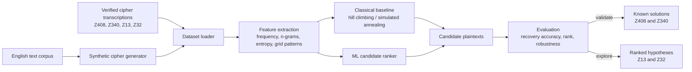

# Zodiac Cipher Analysis

A reproducible cryptanalysis pipeline for ranking Zodiac cipher hypotheses and communicating uncertainty. The project does not attempt to identify a suspect or claim a unique solution for Z13 or Z32.

## Status

- Phase 0: setup complete
- Phase 1: verified Z408, Z340, Z13, and Z32 data complete
- Phase 2: exploration pending

See [`docs/plan.md`](docs/plan.md) for the full phased plan and [`docs/phases/phase-1/`](docs/phases/phase-1/) for completed Phase 1 evidence.

## Architecture



### Methodology

1. Preserve each cipher's symbols and grid layout in a verified transcription.
2. Generate labelled training examples from English text using plausible cipher transformations.
3. Establish a classical cryptanalysis baseline before training an ML model.
4. Train ML only to rank candidates or classify cipher families when justified by baseline results.
5. Validate against Z408 and Z340 using held-out tests.
6. Apply the validated pipeline to Z13 and Z32 and report alternatives.

## Setup

```bash
python3 -m venv .venv
source .venv/bin/activate
pip install -r requirements.txt
```

## Roadmap

1. Explore symbol frequencies, repeated n-grams, entropy, and index of coincidence.
2. Establish a classical search baseline on synthetic and held-out solved ciphers.
3. Generate reproducible synthetic data without source-passage leakage.
4. Add ML only if it improves a predefined baseline metric.
5. Validate robustness, then report ranked hypotheses and limitations.

## Project layout

```text
data/raw/        Verified ciphertext transcriptions and source images
data/reference/  Known Z408 and Z340 plaintexts
docs/            Architecture, plan, and phase records
notebooks/       Reproducible analysis notebooks
src/             Pipeline implementation
tests/           Automated checks
```

## Method boundaries

- Known plaintexts are kept separate from evaluation inputs.
- The pipeline supports hypothesis ranking, not suspect identification.
- Z13 and Z32 are too short to establish a unique solution from ciphertext alone.
- OCR is initially excluded; verified manual transcriptions are the source of truth.
