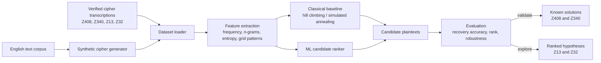

# Zodiac Cipher Analysis Architecture

## Methodology flow

1. Preserve each cipher's symbols and grid layout in a verified transcription.
2. Generate labelled training examples from English text using plausible cipher transformations.
3. Establish a classical cryptanalysis baseline before training an ML model.
4. Train the ML component to rank candidate plaintexts or classify cipher families.
5. Validate against the known Z408 and Z340 solutions using held-out tests.
6. Apply the validated pipeline to Z13 and Z32, reporting alternatives rather than claiming a unique solution.

## Boundaries

- The pipeline supports hypothesis ranking, not suspect identification.
- Z13 and Z32 are too short to establish a unique solution from ciphertext alone.
- OCR is excluded initially; verified manual transcriptions are the source of truth.
